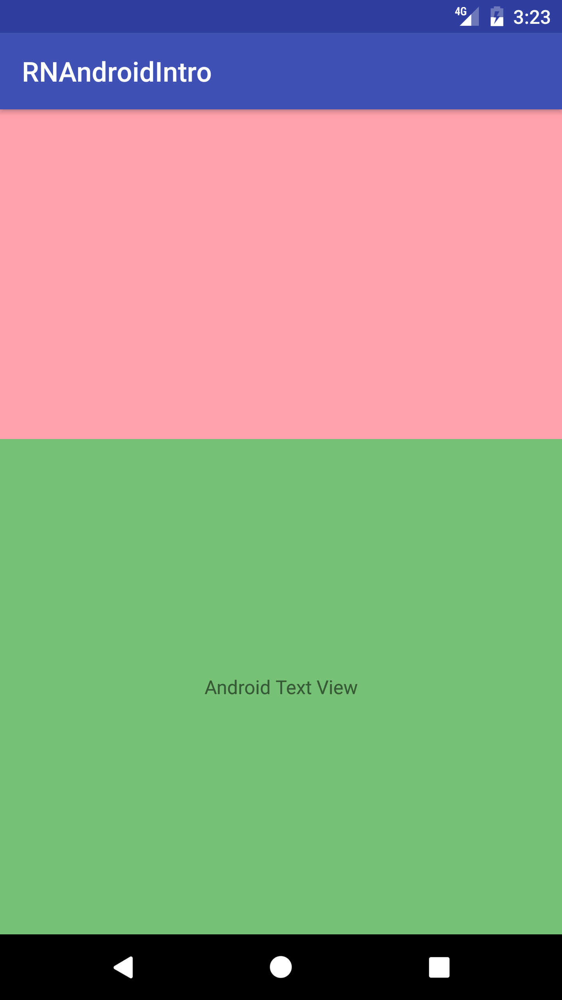
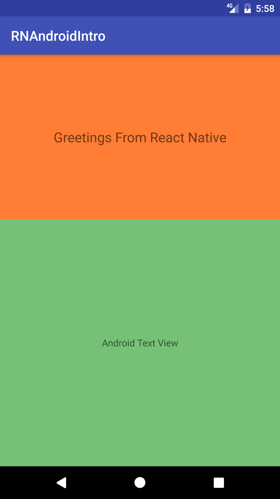

### Where does React Native fit?

Roughly put android application ui follows this hierarchy.

```
Application
│   
│
└───Screen1
│   │
│   └───Activity
│       │   
│       └───Fragment1
|       |   │   
│       |   └───View
│       │   
│       └───Fragment2
│           │
│           └───View
│   
└───Screen2
│   │
│   └───Activity
│       │   
│       └───Fragment1
|       |   │   
│       |   └───View
│       │   
│       └───Fragment2
│           │
│           └───View
│   
```

Application is a collection of screens and transitions among those screens. In android we use an Activity to represent a screen that covers complete screen. Further activity can use fragments and the end of hierarchy it is a view that is actually displaying content.

React Native provides `ReactRootView` which provides android java code with an entry point into React Native world. [`ReactRootView`](https://github.com/facebook/react-native/blob/1e8f3b11027fe0a7514b4fc97d0798d3c64bc895/ReactAndroid/src/main/java/com/facebook/react/ReactRootView.java) eventually inherits from `FrameLayout`, thus its like any other android view. Where ever a view can be used in android, we can use `ReactRootView` and run JavaScript code.

### Overview
The basic idea here is simple. We will split the screen into two parts, one part is rendered by pure android code and another part will be rendered by JavaScript through react-native.

For impatient, here is the quick guide. For others, interested in the detailed guide, skip Quickstart and go to Detailed Guide section.

### Quickstart
1.  Go to this [guide](https://facebook.github.io/react-native/docs/getting-started.html) and install `node`, `watchman` and `react-native-cli`.
2. Clone the repo
3. cd to rn directory and run `npm install`
4. Run the packager with command `npm start` in `rn` directory
5. cd to android directory and open the android project in Android Studio
6. Run the application


### Detailed Guide

###### Android Setup
1. create directory `rn-intro-mobile-developer` in a directory of your choice. Then create two additional directories `rn` and `android` inside this new directory.

```bash
mkdir rn-intro-mobile-developer
cd rn-intro-mobile-developer
mkdir rn
mkdir android
```

2. Fire up android studio and create a new project with blank activity template. Provide above created `android` directory as target for directory location.

3. Replace the standard `activity_main.xml` with the following snippet.

```xml
<?xml version="1.0" encoding="utf-8"?>
<LinearLayout
    xmlns:android="http://schemas.android.com/apk/res/android"
    xmlns:tools="http://schemas.android.com/tools"
    android:layout_width="match_parent"
    android:layout_height="match_parent"
    android:orientation="vertical"
    tools:context="is.uncommon.rn.intro.MainActivity">

  <FrameLayout android:layout_width="match_parent" android:layout_height="0dp"
      android:layout_weight="0.4"
      android:background="#FFA2AC"
      android:id="@+id/reactContainer">

  </FrameLayout>
  <TextView
      android:layout_width="match_parent"
      android:layout_height="0dp"
      android:layout_weight="0.6"
      android:text="Android Text View"
      android:gravity="center"
      android:background="#76C176"/>


</LinearLayout>
```

Run the project and you should see the following screenshot



In the subsequent sections the pink part of the screen will be filled with JavaScript code.

###### React Native setup
1. Go to this [guide](https://facebook.github.io/react-native/docs/getting-started.html) and install `node`, `watchman` and `react-native-cli`.

2. Go to `rn` directory created in the `Android setup` section and run the following command to setup a node project
```bash
npm init -y
```
Replace the created package json with the following
```json
{
  "name": "rn",
  "version": "1.0.0",
  "description": "",
  "main": "index.js",
  "scripts": {
    "test": "echo \"Error: no test specified\" && exit 1",
    "start": "node node_modules/react-native/local-cli/cli.js start"
  },
  "keywords": [],
  "author": "",
  "license": "ISC",
  "dependencies": {
    "react": "16.0.0-alpha.12",
    "react-native": "0.48.4"
  }
}
```
3. Install npm dependencies with the following command
```bash
npm install
```

###### React Hello Component
In `rn` directory create `src` directory. In `src` directory, create a new file called `HelloWorld.js` with the following contents

```JavaScript
import React from "react";
import { StyleSheet, Text, View } from "react-native";

export default class HelloWorld extends React.Component {
  render() {
    return (
      <View style={styles.container}>
        <Text style={styles.hello}>Greetings From React Native</Text>
      </View>
    );
  }
}
var styles = StyleSheet.create({
  container: {
    flex: 1,
    justifyContent: "center",
    backgroundColor: "#FF7D34"
  },
  hello: {
    fontSize: 20,
    textAlign: "center",
    margin: 10
  }
});
```
Do not worry about this JavaScript code if you dont know yet. At this point, understand that this is a react component that can render greetings text that is centered inside a container.

4. Now create `index.android.js` in `rn` directory with following content

```JavaScript
import { AppRegistry } from "react-native";
import HelloWorld from "./src/HelloWorld";

AppRegistry.registerComponent("SayHello", () => HelloWorld);
```

Again do not worry about this JavaScript code if you dont know yet. At this point, understand that this is an entry point index file that will referenced from Android world. This entry point indicates that there is a component available in JavaScript App Registry context which is named `SayHello`. React Native maintains a global registry of components that can be accessed from Android World. In this code we are ensuring that `SayHello` is wired to the `HelloWorld` component created in the previous step.

React native code ready and is now available to android world.

###### Wiring react-native into android.
1. `npm install` in earlier section, creates directory called `node_modules` where all the dependencies are stored. All the dependencies for android are also available in `node_modules`. As of this writing of the article, React Native version is 0.48.4.

2. Go to `app/build.gradle` in your android application. Ensure that the following content matches

```groovy
buildscript {
  repositories {
    jcenter()
    maven {
      url "$rootDir/../../rn/node_modules/react-native/android"
    }
  }
  dependencies {
    classpath 'com.android.tools.build:gradle:2.3.3'

    // NOTE: Do not place your application dependencies here; they belong
    // in the individual module build.gradle files
  }
}

allprojects {
  repositories {
    jcenter()
    maven {
      url "$rootDir/../../rn/node_modules/react-native/android"
    }
  }
}

task clean(type: Delete) {
  delete rootProject.buildDir
}
```

3. Go to android project `build.gradle` and make sure changes in `defaultConfig` ndk filters is made and a dependency on React Native is made as per the following

```groovy

apply plugin: 'com.android.application'

android {
  compileSdkVersion 25
  buildToolsVersion "25.0.3"
  defaultConfig {
    applicationId "is.uncommon.rn.intro"
    minSdkVersion 16
    targetSdkVersion 25
    versionCode 1
    versionName "1.0"
    testInstrumentationRunner "android.support.test.runner.AndroidJUnitRunner"
    ndk {
      abiFilters "armeabi-v7a", "x86"
    }
  }
  buildTypes {
    release {
      minifyEnabled false
      proguardFiles getDefaultProguardFile('proguard-android.txt'), 'proguard-rules.pro'
    }
  }
}

dependencies {
  compile fileTree(dir: 'libs', include: ['*.jar'])
  androidTestCompile('com.android.support.test.espresso:espresso-core:2.2.2', {
    exclude group: 'com.android.support', module: 'support-annotations'
    exclude group: 'com.google.code.findbugs'
  })
  compile 'com.android.support:appcompat-v7:25.3.1'
  compile 'com.android.support.constraint:constraint-layout:1.0.0-beta4'
  compile("com.facebook.react:react-native:0.48.4")
  testCompile 'junit:junit:4.12'
}
```

4. Wire up MainActivity to with react native. Go to `MainActivity.java` and replace class contents with the following code.

```java
public class MainActivity extends AppCompatActivity implements DefaultHardwareBackBtnHandler {

  private static final int OVERLAY_PERMISSION_REQ_CODE = 01;

  private ReactRootView mReactRootView;
  private ReactInstanceManager mReactInstanceManager;

  @Override protected void onCreate(Bundle savedInstanceState) {
    super.onCreate(savedInstanceState);
    if (Build.VERSION.SDK_INT >= Build.VERSION_CODES.M) {
      if (!Settings.canDrawOverlays(this)) {
        Intent intent = new Intent(Settings.ACTION_MANAGE_OVERLAY_PERMISSION,
            Uri.parse("package:" + getPackageName()));
        startActivityForResult(intent, OVERLAY_PERMISSION_REQ_CODE);
        return;
      }
    }

    setContentView(R.layout.activity_main);
    mReactRootView = new ReactRootView(this);

    ((FrameLayout)findViewById(R.id.reactContainer)).addView(mReactRootView);
    mReactInstanceManager = ReactInstanceManager.builder()
        .setApplication(getApplication())
        .setBundleAssetName("index.android.bundle")
        .setJSMainModuleName("index.android")
        .addPackage(new MainReactPackage())
        .setUseDeveloperSupport(BuildConfig.DEBUG)
        .setInitialLifecycleState(LifecycleState.RESUMED)
        .build();
    mReactRootView.startReactApplication(mReactInstanceManager, "SayHello", null);
  }

  @Override
  protected void onActivityResult(int requestCode, int resultCode, Intent data) {
    if (requestCode == OVERLAY_PERMISSION_REQ_CODE) {
      if (Build.VERSION.SDK_INT >= Build.VERSION_CODES.M) {
        if (!Settings.canDrawOverlays(this)) {
          // SYSTEM_ALERT_WINDOW permission not granted...
        }
      }
    }
  }

  @Override
  protected void onPause() {
    super.onPause();

    if (mReactInstanceManager != null) {
      mReactInstanceManager.onHostPause(this);
    }
  }

  @Override
  protected void onResume() {
    super.onResume();

    if (mReactInstanceManager != null) {
      mReactInstanceManager.onHostResume(this, this);
    }
  }

  @Override
  protected void onDestroy() {
    super.onDestroy();

    if (mReactInstanceManager != null) {
      mReactInstanceManager.onHostDestroy(this);
    }
  }

  @Override
  public void onBackPressed() {
    if (mReactInstanceManager != null) {
      mReactInstanceManager.onBackPressed();
    } else {
      super.onBackPressed();
    }
  }

  @Override public void invokeDefaultOnBackPressed() {
    super.onBackPressed();
  }

  @Override
  public boolean onKeyUp(int keyCode, KeyEvent event) {
    if (keyCode == KeyEvent.KEYCODE_MENU && mReactInstanceManager != null) {
      mReactInstanceManager.showDevOptionsDialog();
      return true;
    }
    return super.onKeyUp(keyCode, event);
  }
}
```

5. Go to `AndroidManifest.xml` and ensure relevant permissions are provided. Ensure the contents are similar to

```
  <uses-permission android:name="android.permission.INTERNET" />

  <application
      android:allowBackup="true"
      android:icon="@mipmap/ic_launcher"
      android:label="@string/app_name"
      android:roundIcon="@mipmap/ic_launcher_round"
      android:supportsRtl="true"
      android:theme="@style/AppTheme">
    <activity android:name=".MainActivity">
      <intent-filter>
        <action android:name="android.intent.action.MAIN"/>

        <category android:name="android.intent.category.LAUNCHER"/>
      </intent-filter>
    </activity>

    <activity android:name="com.facebook.react.devsupport.DevSettingsActivity" />
  </application>

```


###### Running the application
1. Go to `rn` directory and start the react native packager with command `npm start`.

2. Go to android studio and run the application. Make sure to give window overlay permissions.

3. Stop and restart the application again from Android Studio. You should see following screenshot. Greetings message from JavaScript should be available in the top container in the screen.



###### Explanation
`ReactRootView` is the key to bridging the views written in JavaScript and Android.
```java
mReactRootView = new ReactRootView(this);
((FrameLayout)findViewById(R.id.reactContainer)).addView(mReactRootView);
mReactInstanceManager = ReactInstanceManager.builder()
    .setApplication(getApplication())
    .setBundleAssetName("index.android.bundle")
    .setJSMainModuleName("index.android")
    .addPackage(new MainReactPackage())
    .setUseDeveloperSupport(BuildConfig.DEBUG)
    .setInitialLifecycleState(LifecycleState.RESUMED)
    .build();
mReactRootView.startReactApplication(mReactInstanceManager, "SayHello", null);
```
The above snippet is the crux of the integration. A `ReactRootView` is created and is added as the child of the container created in android xml. A react instance manager is created to manage JavaScript bridge. By passing `index.android` we are telling the bridge to initialize from the `index.android.js` file that is available in `rn` directory. `index.android.bundle` is used when the application is in release mode and the file is packaged as part of the apk.

Application is started in the `ReactRootView` with given bridge instance. Name of the component to be rendered is also provided as the second argument, which , in this case is `SayHello`. `SayHello` is already available in `AppRegistry`, when the bridge initialized with `index.android.js`. The last argument is an android bundle that gets converted into component props.

Sometimes, JavaScript needs to handle back button hardware. It is provided, by implementing `DefaultHardwareBackBtnHandler` interface.

React Native needs to know when the application is paused, resumed, destroyed, we do this by forwarding activity life cycle methods to react native instance manager.

React native comes with handy dev tools to do bunch of things like, reloading the javascript bundle, hot reloading changes on save, performance monitoring etc. For this it will need window overlay permissions, we ensure that it is given with a little code snippet that directs user to permission settings screen. Finally we wire up `Ctrl + M` or `cmd + M` to bring dev menu.

###### Common Patterns
- Using a singleton instance of react instance manager
- Using bundle to pass props to components
- Using common React Native activity that can be started from anywhere in the app with a pointer to screen
- Common resources like database, shared preferences are exposed with native modules
- Communicating to JavaScript from native via event emitters
