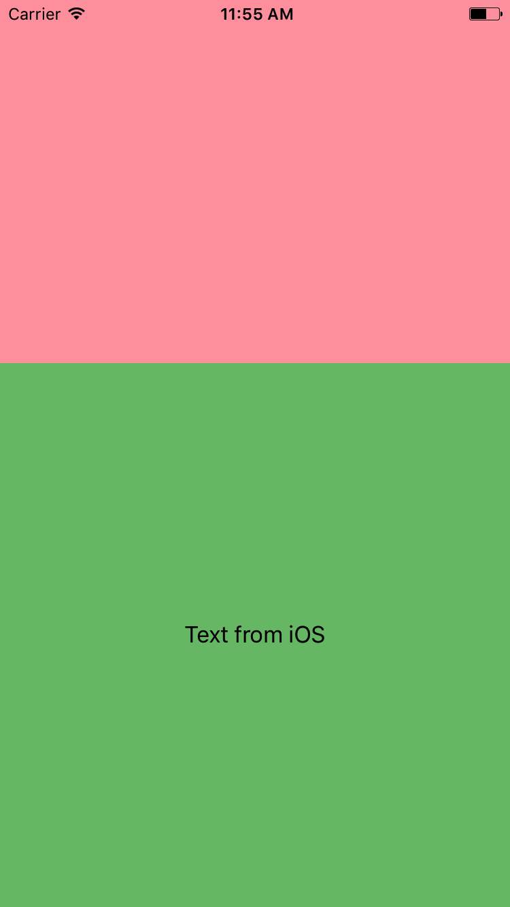
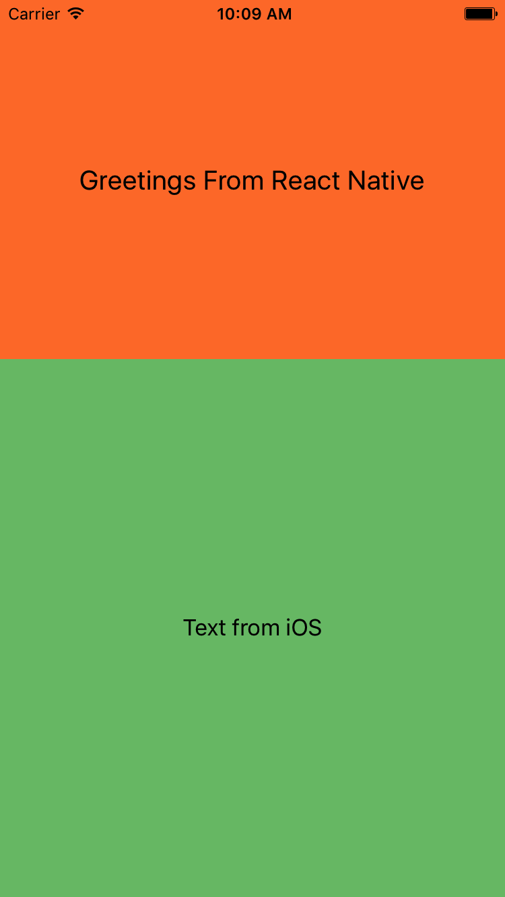

### Where does React Native fit?

Roughly put ios application ui follows this hierarchy.

```
Application
│   
│
└───Screen1
│   │
│   └───UIViewController
│       │   
│       └───UIViewController.view
|           │   
│           └───View
│           │
│           └───View
│   
└───Screen2
│   │
│   └───UIViewController
│       │   
│       └───UIViewController.view
|           │   
│           └───View
│           │
│           └───View   
```

Application is a collection of screens and transitions among those screens. In ios we use a ViewController to represent a screen that covers complete screen. All the views are subsequently added as child elements to root view of the ViewController.

React Native provides `RCTRootView` which provides ios native code with an entry point into React Native world. `RCTRootView` inherits from `UIView`, thus its like any other ios view. Where ever `UIView` can be used in ios, we can use `RCTRootView` and run JavaScript code.

### Overview
The basic idea here is simple. We will split the screen into two parts, one part is rendered by pure ios code and another part will be rendered by JavaScript through react-native.

For impatient, here is the quick guide. For others, interested in the detailed guide, skip Quickstart and go to Detailed Guide section.

### Quickstart
1.  Go to this [guide](https://facebook.github.io/react-native/docs/getting-started.html) and install `node`, `watchman` and `react-native-cli`.
2. Clone the repo
3. cd to rn directory and run `npm install`
4. Run the packager with command `npm start` in `rn` directory
5. cd to ios directory
6. Run `gem install` and then `rake` to install all the required pods. For more on this xcode setup, see my previous [post](https://blog.uncommon.is/increase-developer-productivity-in-your-swift-ios-xcode-project-b52e398a3dc3)
7. Open xcode workspace and then run the app.


### Detailed Guide

###### XCode Setup
- Create directory `rn-intro-mobile-developer` in a directory of your choice. Then create two additional directories `rn` and `ios` inside this new directory.

```bash
mkdir rn-intro-mobile-developer
cd rn-intro-mobile-developer
mkdir rn
mkdir ios
```

- Create a new Xcode workspace as mentioned in this [post](https://blog.uncommon.is/increase-developer-productivity-in-your-swift-ios-xcode-project-b52e398a3dc3)

- Get rid of storyboard configuration. In Project -> General, change main interface to LaunchScreen

- Go to app delegate and add the following code

```swift
self.window = UIWindow(frame: UIScreen.main.bounds)
self.window?.rootViewController = ViewController.newInstance()
self.window?.makeKeyAndVisible()
```

- Create `ViewController.xib` user interface file and wire it up with `ViewController.swift`. Make two container with 2:3 split. In the larger container, add a label ios label with text "text from ios". Sample ViewController code from this repo looks like this.

```swift
import UIKit
import React

class ViewController: UIViewController {

  @IBOutlet weak var reactContainer: UIView!
  static func newInstance() -> ViewController {
    return ViewController(nibName: "ViewController", bundle: nil)
  }
}
```

Run the project and you should see the  something similar to following screenshot



In the subsequent sections the pink part of the screen will be filled with JavaScript code.

###### React Native setup
1. Go to this [guide](https://facebook.github.io/react-native/docs/getting-started.html) and install `node`, `watchman` and `react-native-cli`.

2. Go to `rn` directory created in the `XCode setup` section and run the following command to setup a node project
```bash
npm init -y
```
Replace the created package json with the following
```json
{
  "name": "rn",
  "version": "1.0.0",
  "description": "",
  "main": "index.js",
  "scripts": {
    "test": "echo \"Error: no test specified\" && exit 1",
    "start": "node node_modules/react-native/local-cli/cli.js start"
  },
  "keywords": [],
  "author": "",
  "license": "ISC",
  "dependencies": {
    "react": "16.0.0-alpha.12",
    "react-native": "0.48.4"
  }
}
```
3. Install npm dependencies with the following command
```bash
npm install
```

###### React Hello Component
In `rn` directory create `src` directory. In `src` directory, create a new file called `HelloWorld.js` with the following contents

```JavaScript
import React from "react";
import { StyleSheet, Text, View } from "react-native";

export default class HelloWorld extends React.Component {
  render() {
    return (
      <View style={styles.container}>
        <Text style={styles.hello}>Greetings From React Native</Text>
      </View>
    );
  }
}
var styles = StyleSheet.create({
  container: {
    flex: 1,
    justifyContent: "center",
    backgroundColor: "#FF7D34"
  },
  hello: {
    fontSize: 20,
    textAlign: "center",
    margin: 10
  }
});
```
Do not worry about this JavaScript code if you dont know yet. At this point, understand that this is a react component that can render greetings text that is centered inside a container.

4. Now create `index.ios.js` in `rn` directory with following content

```JavaScript
import { AppRegistry } from "react-native";
import HelloWorld from "./src/HelloWorld";

AppRegistry.registerComponent("SayHello", () => HelloWorld);
```

Again do not worry about this JavaScript code if you dont know yet. At this point, understand that this is an entry point index file that will referenced from iOS world. This entry point indicates that there is a component available in JavaScript App Registry context which is named `SayHello`. React Native maintains a global registry of components that can be accessed from iOS World. In this code we are ensuring that `SayHello` is wired to the `HelloWorld` component created in the previous step.

React native code ready and is now available to ios world.

###### Wiring react-native into ios.
1. `npm install` in earlier section, creates directory called `node_modules` where all the dependencies are stored. All the dependencies for ios are also available in `node_modules` as Cocoapods.

2. Go to `Podfile` and provide entries to react native dependencies. Should looks like the following

```ruby
react_native_path = '../../rn/node_modules/react-native'

target 'RNiOS' do
  # Comment the next line if you're not using Swift and don't want to use dynamic frameworks
  use_frameworks!
  # Pods for help
  pod 'SwiftLint'

  pod 'DoubleConversion', :podspec => react_native_path + '/third-party-podspecs/DoubleConversion.podspec'
  pod 'GLog', :podspec => react_native_path + '/third-party-podspecs/GLog.podspec'
  pod 'Folly', :podspec => react_native_path + '/third-party-podspecs/Folly.podspec'

  pod 'React', :path => react_native_path, :subspecs => [
    'Core',
    'CxxBridge',
    'DevSupport',
    'RCTText',
    'RCTNetwork',
    'RCTWebSocket',
  ]
  pod "Yoga", :path => react_native_path + "/ReactCommon/yoga"
end
```

3. Open xcode workspace and replace ViewController with following. Assuming that outlet connection to react container view is named `reactContainer`.

```swift

import UIKit
import React

class ViewController: UIViewController {

  @IBOutlet weak var reactContainer: UIView!
  static func newInstance() -> ViewController {
    return ViewController(nibName: "ViewController", bundle: nil)
  }

  override func viewDidLoad() {
    super.viewDidLoad()
    // Do any additional setup after loading the view, typically from a nib.
    let jsCodeLocation = URL(string: "http://localhost:8081/index.ios.bundle?platform=ios")
    let rootView = RCTRootView(
      bundleURL: jsCodeLocation,
      moduleName: "SayHello",
      initialProperties: [:],
      launchOptions: nil
    )
    reactContainer.addSubview(rootView!)
    rootView!.translatesAutoresizingMaskIntoConstraints = false
    self.view.addConstraint(NSLayoutConstraint(item: rootView!, attribute: .top, relatedBy: .equal, toItem: reactContainer, attribute: .top, multiplier: 1.0, constant: 0.0))
    self.view.addConstraint(NSLayoutConstraint(item: rootView!, attribute: .leading, relatedBy: .equal, toItem: reactContainer, attribute: .leading, multiplier: 1.0, constant: 0.0))
    self.view.addConstraint(NSLayoutConstraint(item: reactContainer, attribute: .bottom, relatedBy: .equal, toItem: rootView!, attribute: .bottom, multiplier: 1.0, constant: 0.0))
    self.view.addConstraint(NSLayoutConstraint(item: reactContainer, attribute: .trailing, relatedBy: .equal, toItem: rootView!, attribute: .trailing, multiplier: 1.0, constant: 0.0))
    self.view.updateConstraints()
    self.view.layoutIfNeeded()

  }
}

```

5. Go to `Info.plist` and ensure relevant permissions are provided.

```xml
<key>NSAppTransportSecurity</key>
<dict>
  <key>NSExceptionDomains</key>
  <dict>
    <key>localhost</key>
    <dict>
      <key>NSTemporaryExceptionAllowsInsecureHTTPLoads</key>
      <true/>
    </dict>
  </dict>
</dict>

```


###### Running the application
From XCode run the project. React native packager will be automatically started if not already running.



###### Explanation
`RCTRootView` is the key to bridging the views written in JavaScript and iOS.
```swift
let jsCodeLocation = URL(string: "http://localhost:8081/index.ios.bundle?platform=ios")
    let rootView = RCTRootView(
      bundleURL: jsCodeLocation,
      moduleName: "SayHello",
      initialProperties: [:],
      launchOptions: nil
    )
```
The above snippet is the crux of the integration. An `RCTRootView` is created and is added as the child of the container created in user interface. A new react instance manager is created automatically to manage JavaScript bridge when `RCTRootView` is instantiated with URL property. Note that url correctly points to `index.ios.js` which is the entry point in JavaScript. `main.jsbundle` is used when the application is in release mode and the file is packaged as part of the application bundle.

Name of the component to be rendered is provided as the module name argument, which , in this case is `SayHello`. `SayHello` is already available in `AppRegistry`, when the bridge initialized with `index.ios.js`. Using initial properties dictionary properties can be passed from iOS native code to JavaScript component.

React native comes with handy dev tools to do bunch of things like, reloading the javascript bundle, hot reloading changes on save, performance monitoring etc. Use `cmd + D` to bring dev menu & experiment.

If you have come to this point, Congratulations. Now you know how JavaScript code ui code in JavaScript is shown as iOS views.
See [README](../README.md) for tips and tricks on advanced usage and further learning.
